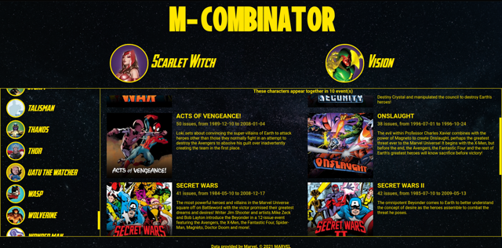

# M-Combinator

This project was created for a React coding challenge.

It uses the [Marvel API](https://marvel.com) to show major comic events in which a given set of characters all appear.

## Usage
This project was built using Node v14.16.1, but should work on any version released in the last year or two.

1. Clone the repo

    `git clone git@github.com:jalovatt/m-combinator.git`
2. Install dependencies

    `npm i` or `yarn`
3. Start the project

    `npm start` or `yarn start`
4. Open it in a browser

    [http://localhost:8080](http://localhost:8080)

## Dependencies

### [Snowpack](https://www.snowpack.dev/)

A modern build tool for web apps, offering extremely fast startup and rebuild times in development environments.

### [Jotai](https://github.com/pmndrs/jotai)

A simple and fast state management library for React, similar to Facebook's Recoil.

## Challenges
Marvel's API can be _extremely_ slow, on the order of one request per second, and characters like Spider-Man might appear in several thousand comic issues.

I initially chose to cache results in the browser's local storage and thus avoid making duplicate requests, which was very effective _once I had fetched the data_, and then only for 24 hours before Marvel requires cached data to expire and be fetched again.

Initial loading times for each request continued to be prohibitive, so I sidestepped the issue by pivoting from comics to "events", of which there are less than a hundred.

## Future Ideas
If I were to spend more time on this project, some notable to-do items include:
- Accessibility testing and appropriate changes. I've done the bare minimum here, but this should really be one of the top concerns for any design + implementation.
- Better standardization/reuse of styles and logic.
- A more responsive layout.
- Proper loading and error handling.
- Searching on the level of individual comic issues, rather than large crossover events. As noted above, there would challenges in fetching the results, and the number of items involved would require the use of lazy-loading or virtual lists in React to avoid bogging down the browser.
- Filtering + sorting the returned events, for instance by year, or being able to _exclude_ a selected character from the results.
